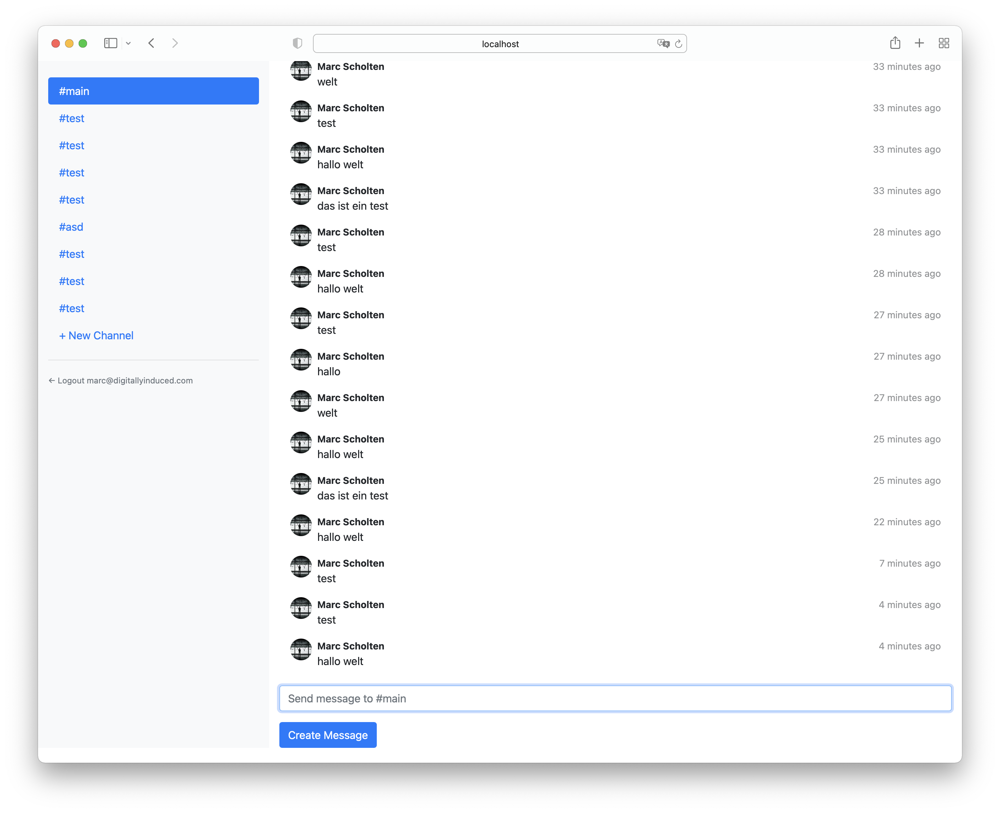

# IHP Example App: Slack-like Chat


This example project implements a basic chat application that looks similiar to slack.

The real-time functionality is implemented using [IHP Auto Refresh](https://ihp.digitallyinduced.com/Guide/auto-refresh.html).

<p align="center">
    
</p>

A live demo is available at [https://ihpchatexampleapp.ihpapp.com/](ihpchatexampleapp.ihpapp.com). You can log in with `demo@digitallyinduced.com` / `demo` or register your own user.


## Running locally

1. [Install IHP](https://ihp.digitallyinduced.com/Guide/installation.html)
2. Start the application:
    ```bash
    ./start
    ```

## Running on GitPod

If you don't have IHP installed locally, you can develop this project in the Cloud with GitPod:

[](https://gitpod.io/#https://github.com/digitallyinduced/ihp-chat-example-app)